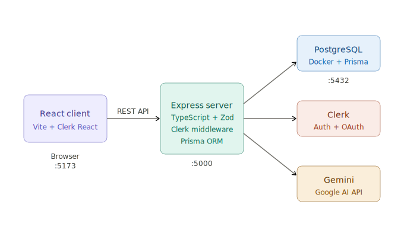

# Compass

Compass is a developer-focused web app that combines authenticated user flows, a type-safe backend, and AI-assisted features to help build a minimal viable product quickly. It solves the problem of bootstrapping an opinionated full-stack TypeScript app (React + Express) with authentication, a database, and LLM integration so engineers can iterate on features instead of wiring infra.

## Tech stack

| Technology | Why |
|---|---|
| React (Vite) | Component model; Vite for fast local dev and HMR |
| Express | Minimal, widely-understood server framework |
| TypeScript | Static types for safer code and stronger portfolio examples |
| Zod | Runtime validation with inferred TypeScript types |
| Prisma | Type-safe ORM with excellent developer DX |
| PostgreSQL | Production-grade relational DB; free hosting options (Railway) |
| Clerk | Authentication without boilerplate (OAuth providers built-in) |
| Gemini (Google AI) | LLM with a free tier adequate for an MVP |

## Local setup (exact order)

1. Clone the repo

```bash
git clone <repo-url>
cd compass
```

2. Install dependencies from the project root

```bash
cd client && npm install && cd ..
cd server && npm install && cd ..
```

3. Copy the example environment file

```bash
cp server/.env.example server/.env
```

4. Create a Clerk application at https://clerk.com
   - Enable Google and GitHub OAuth providers in your Clerk dashboard.
   - Copy the `CLERK_SECRET_KEY` value into `/server/.env` (add as `CLERK_SECRET_KEY=`).
   - Copy the `VITE_CLERK_PUBLISHABLE_KEY` value into `/client/.env` (add as `VITE_CLERK_PUBLISHABLE_KEY=`).

5. Add your Gemini API key
   - Obtain `GEMINI_API_KEY` from Google AI Studio and add it to `/server/.env` as `GEMINI_API_KEY=`.

6. Start local infrastructure (Postgres) via Docker Compose

```bash
docker-compose up -d
```

7. Run Prisma migrations (from the `server` directory)

```bash
cd server
npx prisma migrate dev
cd ..
```

8. Start the development servers from the project root

```bash
npm run dev
```

Notes:
- Ensure `/client/.env` and `/server/.env` contain the relevant keys before starting the app.
- If you change the Prisma schema, re-run `npx prisma migrate dev` from `/server`.

## Architecture



## Live URL

TBD — will provide the production URL after deployment.

---

This README is a living document. Add setup notes, architecture diagrams, deployment steps, and troubleshooting tips as the project evolves.
